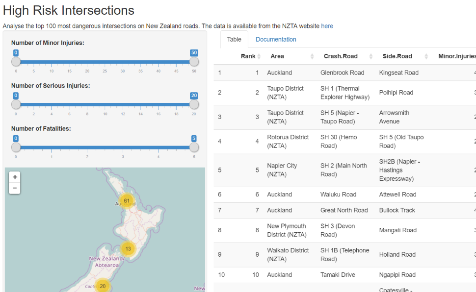

```{r setup, include=FALSE}
knitr::opts_chunk$set(echo = FALSE)
```

## Intersections are dangerous!

Driving can be a dangerous activity and it's especially dangerous at intersections.  

The New Zealand government intends to improve safety at intersections by analyzing intersections that are particularly dangerous and actively trying to improve the safety.

There is further information here: http://www.nzta.govt.nz/resources/high-risk-intersections-guide/

## The application

To help the NZTA and public analyze the data th High Risk Intersections application will help.

The application has the following features:

- View a table of high risk intersections
- Built-in documentation
- Dynamic control of which intersections are shown based on number and type of casualties
- A visual map of the country showing where the filtered intersections are


## The application in action

The following screenshot shows the application in action



## Thanks

Thanks for your attention

Try the app here: https://craiglarmer.shinyapps.io/high_risk_intersections/